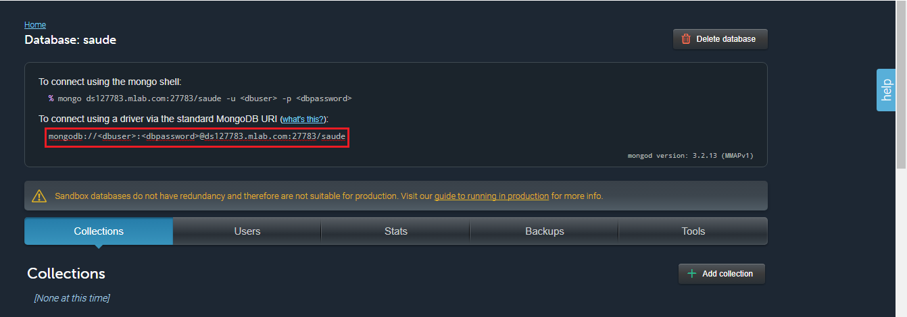
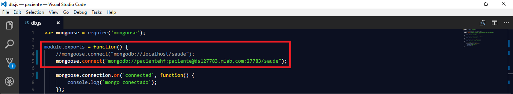
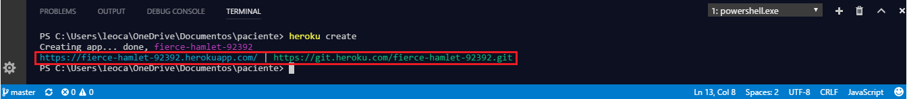
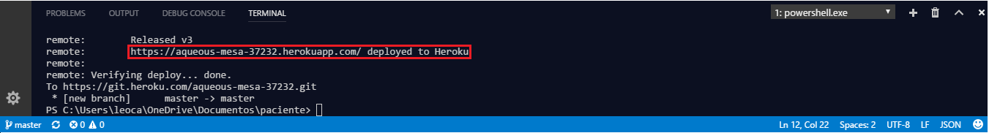

# PaCiente
O “PaCiente” foi desenvolvido visando qualificar os serviços prestados por estabelecimentos públicos de saúde (UPAs, PSFs, Hospitais...). 
O sistema tem como objetivos expor indícios de corrupção nesses estabelecimentos dando ao usuário o poder para avaliar os mesmos e expor sua satisfação ou não quanto ao serviço e o ajudar também em sua tomada de decisão, visto que o usuário tem a opção de ver quais estabelecimentos são mais bem avaliados e a partir disso, decidir qual estabelecimento buscar.

## Sumário

- [Instalação](#instalação)
- [Hospendando o Banco de Dados](#hospedando-o-banco-de-dados)
- [Fazendo Deploy](#fazendo-deploy)

## Instalação

1. Tenha certeza de ter instalado o [Git](https://git-scm.com/downloads);
2. Tenha certeza de ter instalado o [Node.js](https://nodejs.org/en/download/);
3. Tenha certeza de ter instalado o [Mongo DB](https://www.mongodb.com/download-center#community) (Community Server);
4. Clone este repositório com `$git clone https://github.com/PacienteHF/paciente` e vá para a pasta clonada ;
5. Instale as dependências do sistema com `$npm install`;
6. Insira a base de dados. Para isso vá para a pasta 'dados' que está dentro da pasta raiz do projeto e rode `$node .\insertDadosDB.js`;
7. Volte para a pasta raiz e rode `$node .\server.js`;
8. Em qualquer navegador vá para [http://localhost:3000](http://localhost:3000/).

## Deploy

### Hospedando o Banco de Dados
É necessário que se tenha uma conta cadastrada no [mLab](https://mlab.com/).

1. Criando o Banco de Dados:
    1. Na home de sua conta no mLab, em *MongoDB Deployments*, clique em *Create New*;
    2. Em *Cloud Provider* sugerimos que selecione a plataforma da Amazon e em *Plan Type* ultizamos para testes o plano Sandbox(Free).     Continue;
    3. Em *AWS Region* sugerimos que selecione US East (Virginia)(us-east-1). Continue;
    4. Em *Database Name* escolha um nome para a base de dados. Utilizamos o nome "saude" mas sinta-se livre a mudar. Continue;
    5. Submit Order.

2. Conectando a aplicação ao Banco de Dados criado:
    1. Na Home de sua conta, clique no nome do banco de dados criado acima;
    2. Para se conectar ao banco teremos que criar um usuário e senha. Para isso clique na aba *Users* e em seguida *Add database user*;
    3. Escolha o nome de usuário e senha que preferir;
    4. Adicione ao código em (config\db.js) `mongoose.connect("")` e a URI gerada na criação do banco de dados dentro dos parênteses.       Não esqueça de substituir <dbuser> pelo usuário criado e <dbpassword> pela senha escolhida;
    
    5. Comente a linha `mongoose.connect("mongodb://localhost/saude");`, que está no mesmo script e salve as alterações;
    
    6. Insira a base de dados. Para isso vá para a pasta 'dados' que está dentro da pasta raiz do projeto e rode `$node         .\insertDadosDB.js`;
    7. Atualize o git depois das alterações: `$git add config/db.js` -> `$git commit -m "comentario"` -> `$git push`.

### Fazendo Deploy
É necessário que se tenha uma conta cadastrada no [Heroku](https://www.heroku.com/).

1. Tenha certeza de ter o [Heroku Toolbelt](https://devcenter.heroku.com/articles/heroku-cli) instalado;
2. Na pasta raiz, execute `$heroku login` para logar em sua conta;
3. Depois de autenticado, execute `$heroku create` para criar o repositório onde ficará hospedada a aplicação;

4. Agora execute `$git push heroku master` e espere alguns minutos;
5. Quando terminado, você já terá acesso ao link. 

